# 4. User Manual & Core Functionality (用户手册与核心功能)

> 本章节将按照用户角色展示核心功能截图与操作说明。
## 4.0 Registration & Login (通用于各个角色)
* **Identify**:
 首先进入login.html，这是整个系统的起点。不同角色的人都要使用这个界面。顾客选择“我是顾客”，员工选择“我是员工”。
* **For Customers**:
 顾客可以选择用已有账号登录。如果没有账号就可以注册一个。后续将开发注册功能。
* **For Staff and Management**:
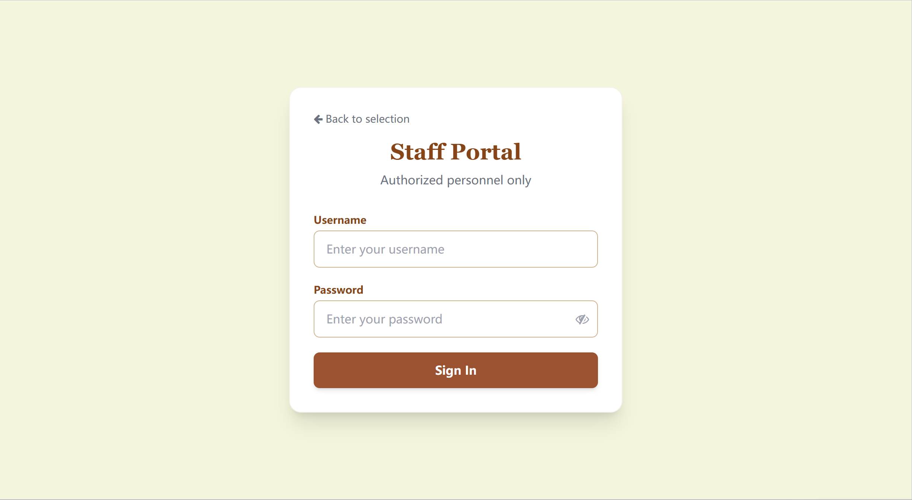 员工只能登录，员工的注册由管理层的后台完成。

## 4.1 For Customers (客户指南)
* **Home**:
 登录之后首先看到的首页包含公告和书店简介。虽然首页展示的不是可浏览的书籍，但简单的界面让顾客感到轻松。
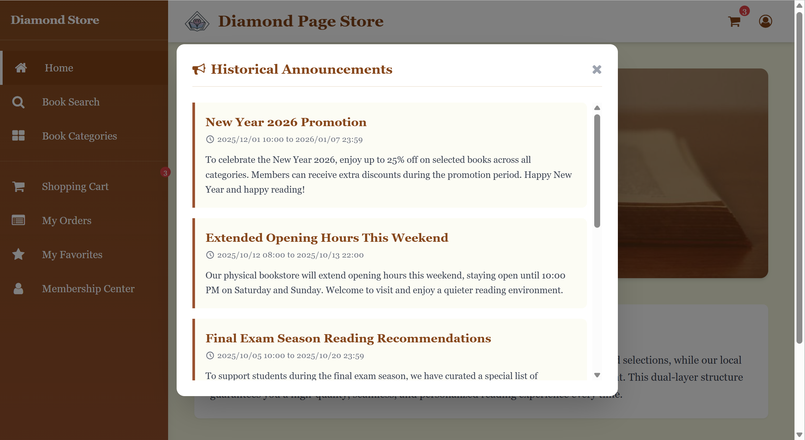 点击learn-more按钮之后可以看到以往的历史公告。包含公告的标题，开始以及结束时间，还有公共的内容。
* **Personal profile**:
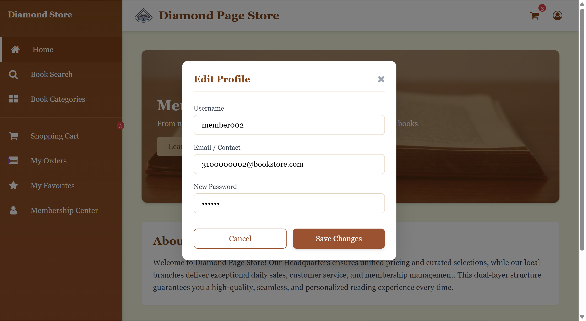 点击右上角的修改个人信息按钮，你可以修改自己的昵称、邮箱（联系方式）以及密码。
* **Searching**:
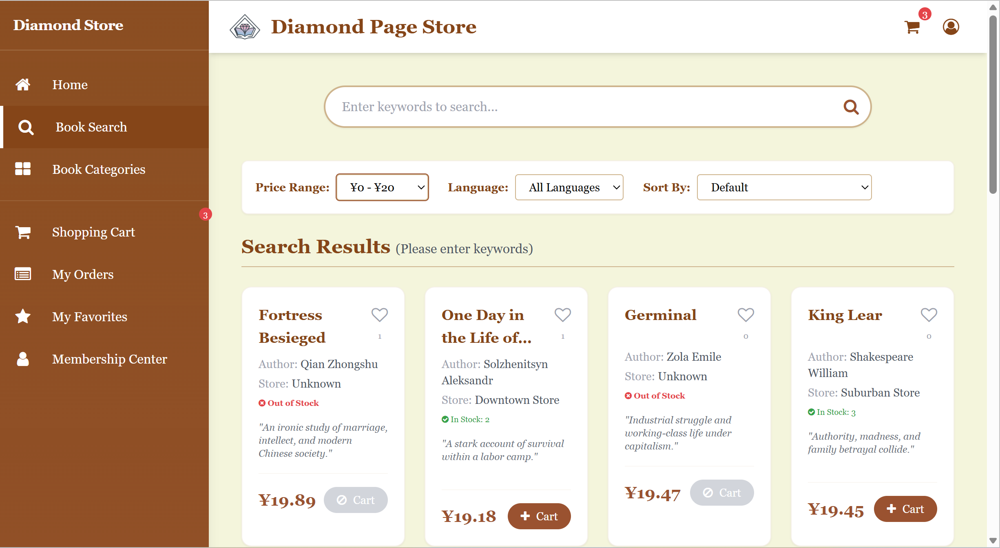 用户有两种方式可以搜索到自己想要的书，首先在不知道书名或者只是想先浏览筛选书籍时，可以直接选择筛选框里面的条件，根据价格区间、书籍所属语言以及书本受欢迎程度和价格从高到低或者从低到高等来排序。系统会返回所有符合筛选条件的书籍。另外一种就是在有明确目的的情况下搜索，只需要在关键词栏输入关键词后选择自己想要的筛选条件并回车或者点击搜索小标，就能得到结果。同样书名的书可能有不同的装订方式，或在不同的店铺有存货。搜索后都会展示出来。用户可以根据搜索结果决定购买或者收藏什么书籍。
* **Category**:
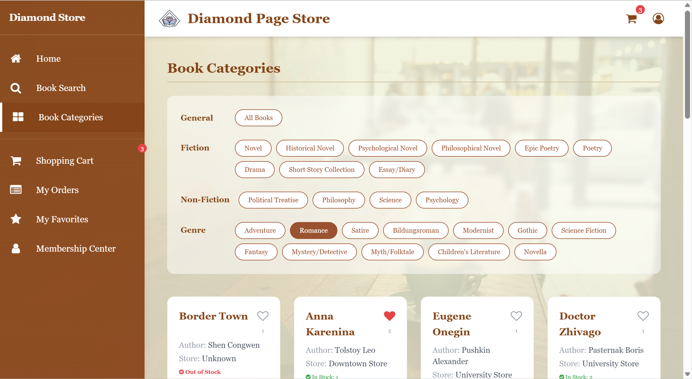 书籍分类页展示了所有不同类别的书籍，有些书籍会有多种类别。
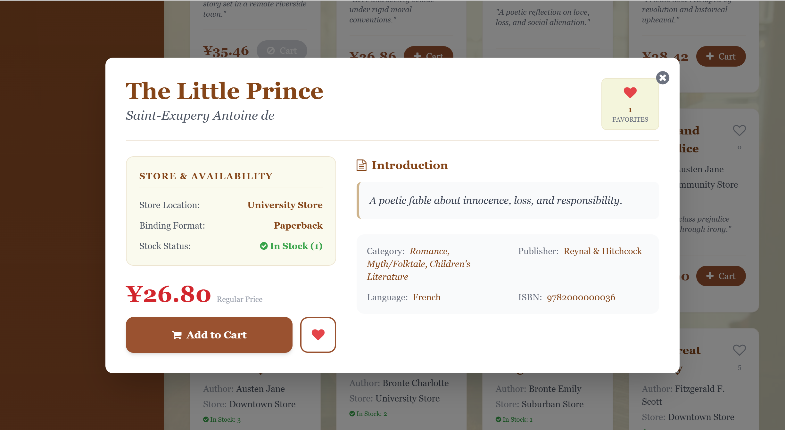 在搜索页、分类页、购物车页以及收藏页展示的书籍小卡片都可以点击，点击之后会弹出书籍详情页弹窗。详细展示了书籍的各类信息。右上角的收藏只是展示数量，左下方的才是加入购物车和收藏的功能按钮。
* **Cart**:
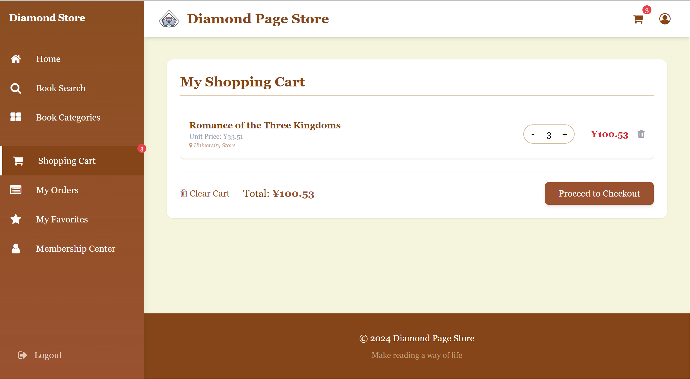 购物车页展示了用户加入购物车的物品。当选择多项物品时，用户可以选择单个删除也可以一起删除。用户可以增减物品数量，并在物品卡片右侧看到单价。不管在哪个界面，如果点击右上角购物车小标的按钮，就可以跳转到购物车。点击“Proceed to Checkout”按钮后会创建一个新的订单。
* **Orders**:
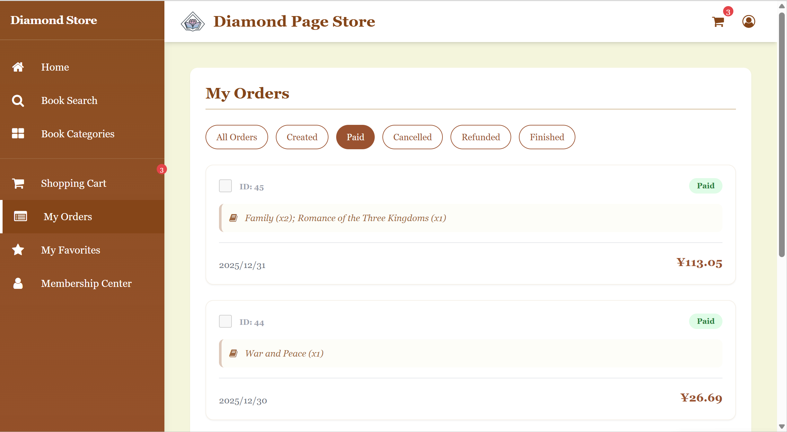 订单分为创建、已经付款、取消支付、已退款还有结束五种状态。由于本店是兼顾线上线下的营业，所以退款操作和结束操作是由店员在后台系统完成的。用户可以选择线下来取书也可以选择快递……总而言之，当订单完全结束后，员工会在后台修改订单状态，用户也将在这个界面看到订单状态的变化。
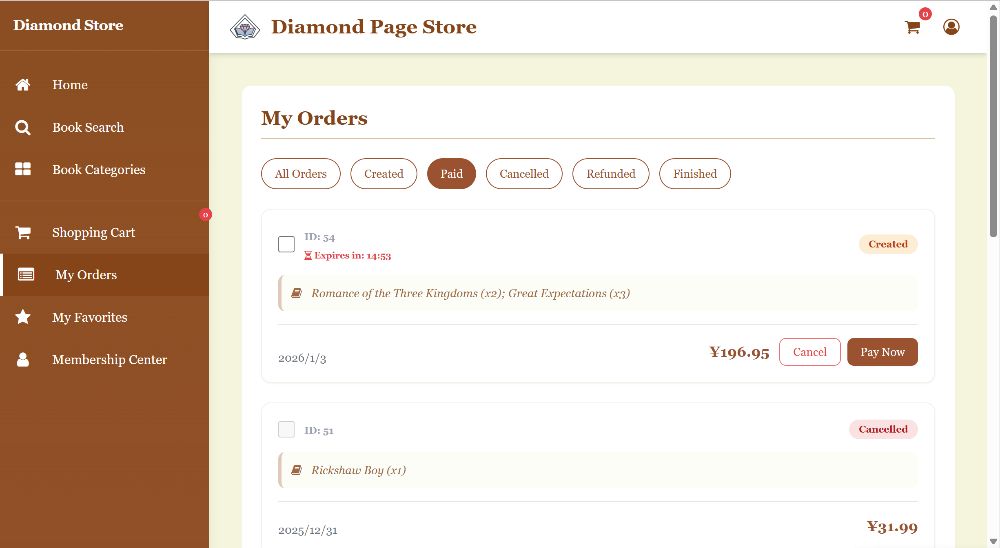 刚创建订单之后会马上启动一个15分钟的倒计时，如果用户没有在15分钟内支付，我们认为他/她是对这个物品不感兴趣的，所以订单会因为超时而取消。当然用户也可以点击取消按钮来决定马上取消。
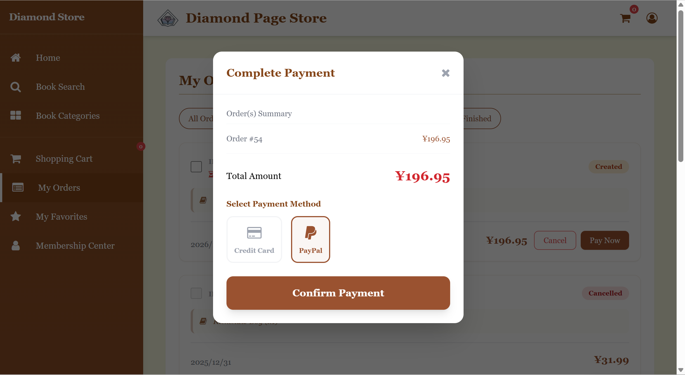 用户支付的界面我们使用的是模拟支付，可以选择不同的支付方式。
* **Favorites**:
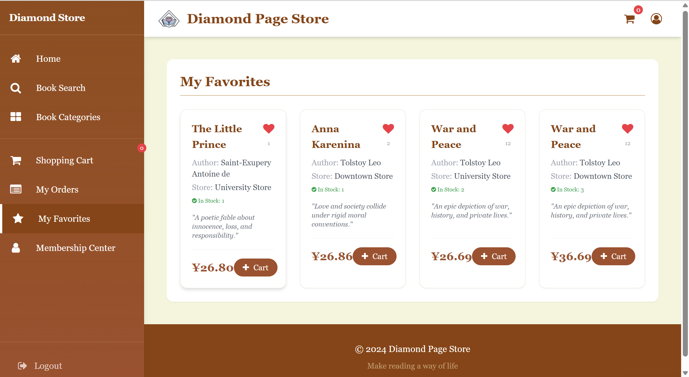 展示用户喜欢的书籍卡片。
* **Membership Center**:
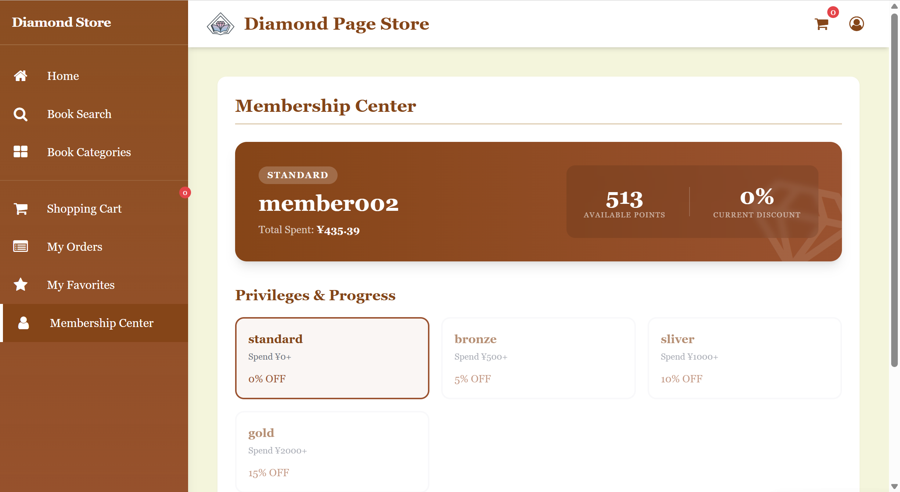 这里展示了用户的支付累计以及积分，还有各类会员等级及其优惠力度，深色框出来的就是用户当前的等级。后续打算开发一个积分兑换礼品的栏目。
* **Logout**:
页面右下角的logout按钮点击之后就会登出。

## 4.2 For Staff (店员指南)
* **Dashboard (仪表盘)**:
店员登录后首先进入仪表盘，可以直观地看到门店的运营概况。
    * **统计数据**: 显示当前门店的总库存量、低库存预警数（库存为1的书籍）以及总订单数。
    * **最近订单**: 快速查看最新的10笔订单及其状态。
    * **低库存预警**: 列出急需补货的书籍，点击“Restock”可快速跳转至库存管理页面。(想跳转过去之后高亮显示，但是做不完舍弃了)

* **Inventory Management (库存管理)**:
店员可以全面管理所属门店的书籍库存。
    * **库存列表**: 支持按书名、ISBN搜索，按类别、库存水平（High/Medium/Low）筛选。
    * **添加书籍**: 点击“Add New Book”可以录入新书的详细信息，包括作者、出版社、装订方式、价格及初始库存。
    * **编辑库存**: 点击“Edit”可以修改现有书籍的库存数量和批次代码。系统会自动锁定书籍的基本信息（如书名、ISBN），仅允许修改库存相关数据以确保数据一致性。

* **Order Processing (订单处理)**:
店员负责处理客户发往该门店的订单。
    * **订单筛选**: 支持按订单号、客户名搜索，以及按订单状态（Created/Paid/Cancelled/Finished等）和日期范围进行过滤。
    * **详情查看**: 点击“View Details”可查看订单内的具体书籍清单、单价及小计。
    * **状态更新**: 店员可以根据实际业务流程（如线下付款、备货完成、客户取货等）手动更新订单状态。

* **Stock Requests (补货申请)**:
当门店库存不足时，店员可以向管理层发起补货请求。
    * **发起请求**: 点击“New Request”，通过搜索书名选择需要补货的书籍（系统自动匹配ISBN和SKU），并填写申请数量和备注。
    * **状态跟踪**: 查看申请的审批进度（Pending/Approved/Rejected）。
    * **详情查看**: 点击“View”可查看调货申请的具体书籍、数量、时间及状态。
    * **确认收货**: 对于已批准（Approved）的申请，当货物送达后，店员点击“Receive”确认收货，系统将自动更新门店库存。

## 4.3 For Managers (经理指南)
经理角色拥有系统的最高管理权限，负责监控全盘业务、管理人员及供应商。

*   **Overview & Analytics (业务概览与分析)**:
    经理登录后的首页展示了全连锁店的运营数据分析。
    *   **统计卡片**: 实时显示表现最佳的分店、最受欢迎的支付方式以及销售额最高的书籍类别。
    *   **可视化图表**: 通过柱状图直观对比各分店的订单量。
    *   **多维报表**: 包含支付方式占比分析表和书籍类别销售统计表，帮助经理进行财务决策和选品优化。

*   **Staff Management (员工管理)**:
    经理负责全连锁店的人事行政工作。
    *   **员工列表**: 集中展示所有分店的员工信息，支持按分店和职位（Manager/Staff/Finance）进行筛选。
    *   **入职管理**: 点击“Add Staff”可为新员工创建系统账号，分配所属门店和职位。
    *   **信息维护**: 支持修改员工的联系方式、所属门店及职位，并可执行离职注销操作。

*   **User Management (用户管理)**:
    负责维护系统所有账号的安全与状态。
    *   **账号审计**: 查看所有注册用户（包括客户和员工）的最后登录时间和账号状态。
    *   **安全控制**: 经理可以重置任何用户的密码（重置为系统默认密码），或在必要时禁用/删除违规账号。

*   **Inventory & Replenishment (库存与补货审批)**:
    经理掌握着库存调拨和补货的最终审批权。
    *   **全盘库存**: 可以按分店或按书籍（SKU）两种维度查看全连锁店的实时库存分布。
    *   **补货审批**: 审核各分店提交的补货申请。经理可以查看申请详情（包括紧急程度和原因），并决定批准（Approve）或拒绝（Reject）。
    *   **定价管理**: 经理拥有修改书籍零售价格的权限，确保全连锁店价格策略的一致性。

*   **Supplier Management (供应商管理)**:
    维护书店的供应链体系。
    *   **供应商名录**: 记录所有合作伙伴的联系方式和地址。
    *   **合作维护**: 支持添加新供应商、编辑现有供应商信息或删除不再合作的供应商。

*   **Notifications (公告发布)**:
    经理可以发布系统公告，这些公告将直接展示在客户首页的公告栏中，用于发布促销活动或书店动态。

## 4.4 For Finance (财务指南)

* 